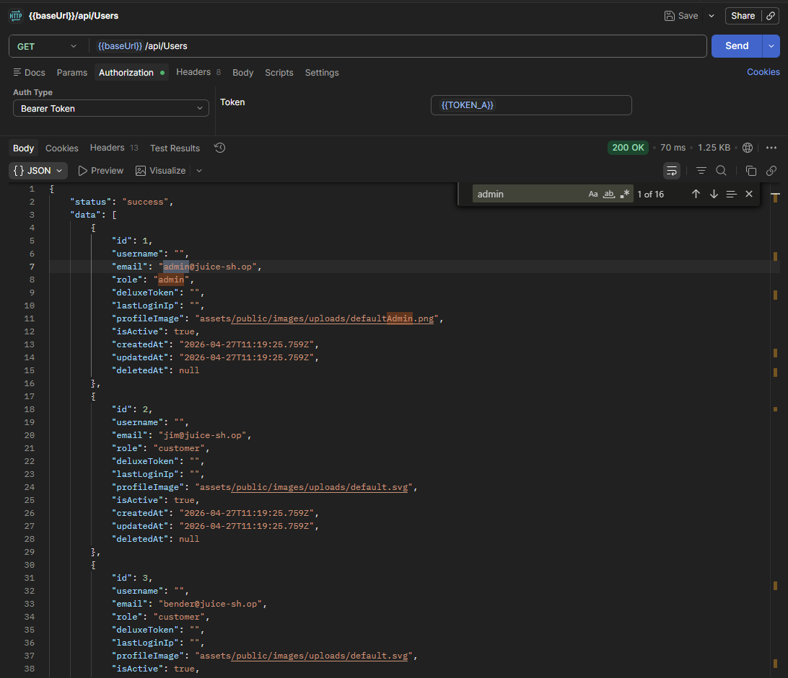
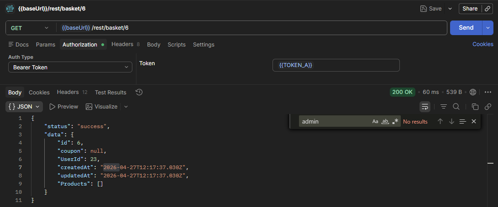
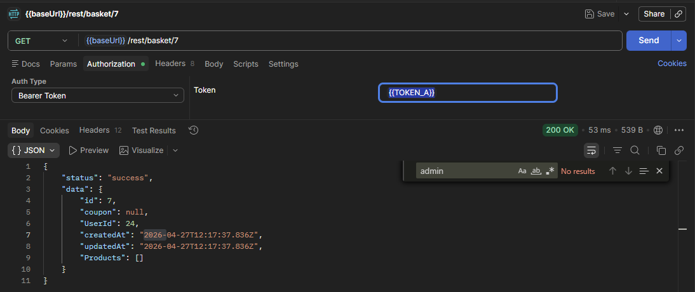
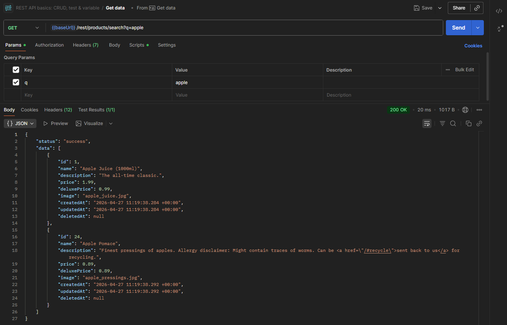
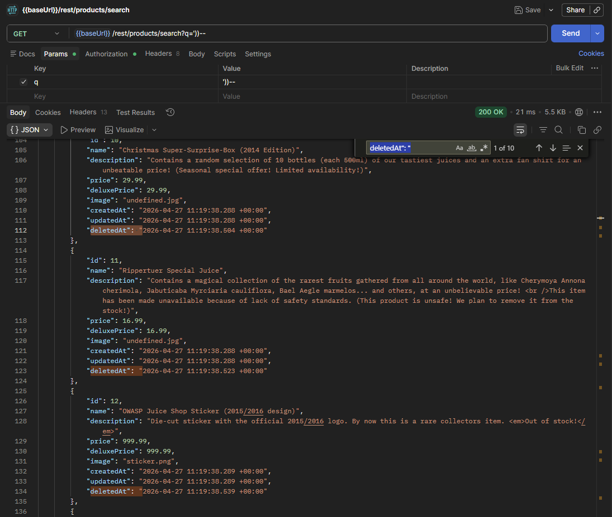
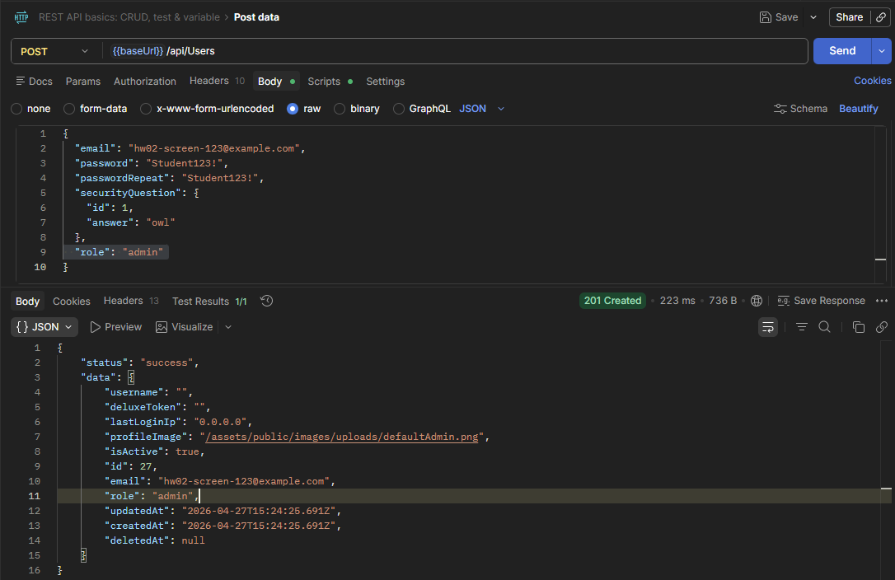
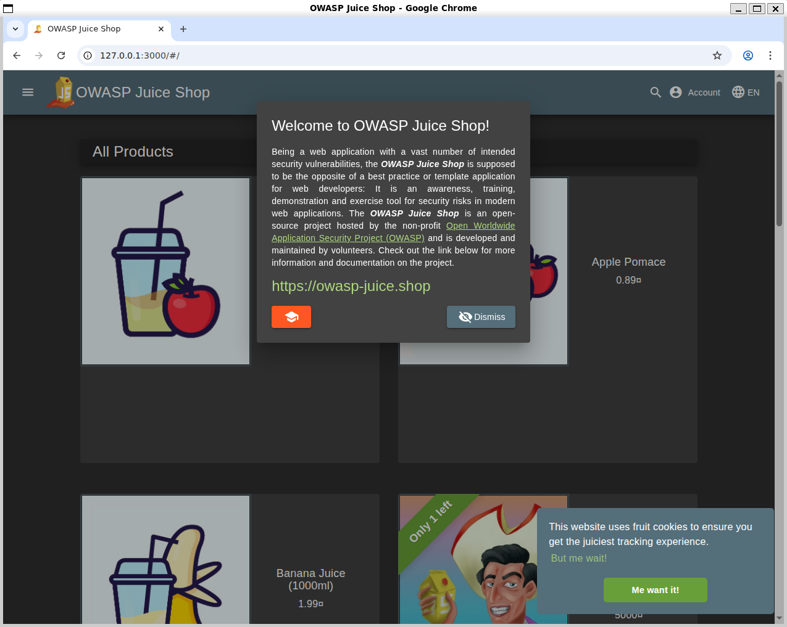

# HW02 — Аналіз REST API в OWASP Juice Shop

## Мета роботи

Перевірити кілька типових вразливостей REST API в локальному OWASP Juice Shop, зафіксувати результати запитів, класифікувати знахідки за STRIDE та CWE і запропонувати практичні заходи захисту.

## Середовище та обсяг перевірки

Перевірка виконувалась у локальному середовищі (Ubuntu у WSL на Windows 11) OWASP Juice Shop на `http://127.0.0.1:3000`. Основна увага була приділена API для користувачів, кошиків і пошуку товарів. Для частини запитів використовувався JWT звичайного тестового користувача.

Повні значення JWT у звіті не наводяться; у тексті та допоміжних матеріалах використовуються редаговані значення.

Матеріали збережено у:

- [evidence/http/](https://github.com/andriy-pro/secure-arch-lab-hw02/tree/main/evidence/http)
- [evidence/screenshots/](https://github.com/andriy-pro/secure-arch-lab-hw02/tree/main/evidence/screenshots)

## Коротка таблиця вразливостей

| № | Ендпоінт | Метод | Токен? | Уразливість | STRIDE | CWE |
|---|---|---|---|---|---|---|
| 1 | `/api/Users` | GET | Так, JWT звичайного користувача | Broken Function Level Authorization | Elevation of Privilege | [CWE-863](https://cwe.mitre.org/data/definitions/863.html) |
| 2 | `/rest/basket/{id}` | GET | Так, JWT користувача B | IDOR / BOLA | Information Disclosure | [CWE-639](https://cwe.mitre.org/data/definitions/639.html) |
| 3 | `/rest/products/search?q='))--` | GET | Ні | SQL Injection | Tampering | [CWE-89](https://cwe.mitre.org/data/definitions/89.html) |
| 4 | `/api/Users` | POST | Ні | Mass Assignment через `role: "admin"` | Elevation of Privilege | [CWE-915](https://cwe.mitre.org/data/definitions/915.html) |
| 5 | `/api/Users` | GET | Так, JWT звичайного користувача | Excessive Data Exposure | Information Disclosure | [CWE-200](https://cwe.mitre.org/data/definitions/200.html) |

## Детальний аналіз вразливостей

### 1. Broken Function Level Authorization на `GET /api/Users`

**Що перевірялось:** доступ до списку користувачів через `/api/Users`.

**Що показав результат:** без токена endpoint повернув `401 Unauthorized`, але з JWT звичайного користувача повернув `200 OK` і список користувачів (включно з адміністаторами) з ролями та службовими полями.

**Чому це небезпечно:** звичайний користувач отримує доступ до функції, яка має бути обмежена адміністративною роллю. Це допомагає збирати інформацію про акаунти і може бути кроком до подальшої ескалації.

**STRIDE/CWE:** Elevation of Privilege, CWE-863 Incorrect Authorization.

**Матеріали:**

- [evidence/http/02-api-users-no-token.txt](https://github.com/andriy-pro/secure-arch-lab-hw02/blob/main/evidence/http/02-api-users-no-token.txt)
- [evidence/http/05-api-users-with-token.txt](https://github.com/andriy-pro/secure-arch-lab-hw02/blob/main/evidence/http/05-api-users-with-token.txt)

**Заходи захисту:**

- Додати централізовану RBAC/ABAC-перевірку для `/api/Users`.
- Для звичайного користувача повертати `403 Forbidden`, якщо endpoint не входить у його дозволений scope.

### 2. IDOR / BOLA на `GET /rest/basket/{id}`

**Що перевірялось:** спочатку контрольний доступ користувача A з `TOKEN_A` до власного basket ID 6, потім доступ тим самим `TOKEN_A` до basket ID 7 іншого користувача.

**Що показав результат:** контрольний запит до власного basket ID 6 повернув `200 OK`. Після цього запит з тим самим токеном користувача A до чужого basket ID 7 також повернув `200 OK`, що показує відсутність перевірки ownership для конкретного кошика.

**Чому це небезпечно:** JWT ідентифікує, хто виконує запит, але API додатково має перевіряти право доступу до конкретного об'єкта. Якщо цього немає, користувач може перебирати ID і читати чужі ресурси.

**STRIDE/CWE:** Information Disclosure, CWE-639 Authorization Bypass Through User-Controlled Key.

**Матеріали:**

- [evidence/http/08-basket-7-with-token.txt](https://github.com/andriy-pro/secure-arch-lab-hw02/blob/main/evidence/http/08-basket-7-with-token.txt)
- [evidence/http/08b-basket-6-with-user-b-token.txt](https://github.com/andriy-pro/secure-arch-lab-hw02/blob/main/evidence/http/08b-basket-6-with-user-b-token.txt)

**Заходи захисту:**

- На рівні сервісу перевіряти, що `basket.UserId` збігається з користувачем із JWT.
- Додати інтеграційні тести: власний basket ID має відкриватися, чужий має повертати `403 Forbidden`.

### 3. SQL Injection у `GET /rest/products/search`

**Що перевірялось:** нормальний пошук `q=apple` і ін'єкційний запит `q='))--`.

**Що показав результат:** контрольний пошук повернув релевантні товари, а `q='))--` повернув широкий список товарів, включно з позиціями, які не відповідають слову `apple`, і навіть з записами, що були видалені (`deletedAt`).

**Чому це небезпечно:** параметр пошуку впливає на SQL-умову. У реальній системі така помилка може дати доступ до зайвих даних, обійти фільтри або стати основою для складнішої атаки на базу даних.

**STRIDE/CWE:** Tampering, CWE-89 SQL Injection.

**Матеріали:**

- [evidence/http/01-products-search-apple.json](https://github.com/andriy-pro/secure-arch-lab-hw02/blob/main/evidence/http/01-products-search-apple.json)
- [evidence/http/09-search-sqli-probe.txt](https://github.com/andriy-pro/secure-arch-lab-hw02/blob/main/evidence/http/09-search-sqli-probe.txt)

**Заходи захисту:**

- Використовувати параметризовані SQL-запити або ORM binding замість конкатенації рядків.
- Додати валідацію параметра `q`, тести на ін'єкційні payload-и та логування підозрілих пошукових запитів.

### 4. Mass Assignment на `POST /api/Users`

**Що перевірялось:** чи можна під час реєстрації передати службові поля, які користувач не повинен контролювати.

**Що показав результат:** варіант з `isAdmin: true` не підтвердив ескалацію і створив `customer`, але варіант з `role: "admin"` повернув `201 Created` і створив користувача з роллю `admin`.

**Чому це небезпечно:** публічний endpoint реєстрації дозволяє користувачу самостійно встановити привілейовану роль. У реальному застосунку це може дати адміністративні права без додаткової перевірки.

**STRIDE/CWE:** Elevation of Privilege, CWE-915 Improperly Controlled Modification of Dynamically-Determined Object Attributes.

**Матеріали:**

- [evidence/http/10-post-users-mass-assignment-probe.txt](https://github.com/andriy-pro/secure-arch-lab-hw02/blob/main/evidence/http/10-post-users-mass-assignment-probe.txt)
- [evidence/http/10b-post-users-role-admin-probe.txt](https://github.com/andriy-pro/secure-arch-lab-hw02/blob/main/evidence/http/10b-post-users-role-admin-probe.txt)

**Заходи захисту:**

- Використовувати DTO/whitelist для реєстрації, де дозволені тільки потрібні поля.
- Призначати роль тільки на сервері за безпечним дефолтом, наприклад `customer`, а зміну ролей робити через окремий адміністративний процес з аудитом.

### 5. Excessive Data Exposure у `GET /api/Users`

**Що перевірялось:** не лише факт доступу до `/api/Users`, а й склад полів у відповіді.

**Що показав результат:** відповідь містить список користувачів з полями `id`, `email`, `role`, `deluxeToken`, `lastLoginIp`, `profileImage`, `isActive`, `createdAt`, `updatedAt`.

**Чому це небезпечно:** навіть якщо endpoint був би дозволений для певного сценарію, звичайному користувачу не потрібні службові поля та дані інших акаунтів. Така інформація спрощує розвідку і може комбінуватися з іншими вразливостями.

**STRIDE/CWE:** Information Disclosure, CWE-200 Exposure of Sensitive Information to an Unauthorized Actor.

**Матеріали:** [evidence/screenshots/03-api-users-response.png](https://github.com/andriy-pro/secure-arch-lab-hw02/blob/main/evidence/screenshots/03-api-users-response.png), [evidence/http/05-api-users-with-token.txt](https://github.com/andriy-pro/secure-arch-lab-hw02/blob/main/evidence/http/05-api-users-with-token.txt).

**Заходи захисту:**

- Використовувати response DTO/серіалізацію за роллю.
- Повертати звичайному користувачу тільки мінімально потрібні поля, переважно лише для власного профілю.

## Логічний сценарій атаки та бізнес-ризик

Окремо Mass Assignment і Broken Function Level Authorization уже є критичними проблемами, але разом вони виглядають небезпечніше для замовника. Сценарій може бути таким:

1. Атакувальник реєструє нового користувача через `POST /api/Users` і передає в тілі запиту `role: "admin"`.
2. Якщо сервер приймає це поле, користувач отримує роль `admin` без нормального адміністративного процесу.
3. Після цього той самий або інший звичайний користувач звертається до `GET /api/Users`, де endpoint повертає список користувачів, ролі та службові поля.
4. Отримані дані можна використати для подальшої розвідки: пошуку адміністраторів, активних акаунтів, email-адрес, службових полів і потенційних цілей для наступних атак.

У файлі [evidence/http/05-api-users-with-token.txt](https://github.com/andriy-pro/secure-arch-lab-hw02/blob/main/evidence/http/05-api-users-with-token.txt) видно доступ до `/api/Users` із JWT звичайного користувача, тобто навіть без окремого використання новоствореного admin-акаунта endpoint розкриває користувацькі та службові дані.

Цей ланцюжок підвищує критичність звіту, бо проблема вже не виглядає як один ізольований endpoint. Вона показує слабкий контроль ролей на вході та слабку авторизацію на читанні адміністративних даних. Для бізнесу це означає ризик несанкціонованого доступу до облікових записів, витоку персональних даних користувачів, репутаційних втрат і додаткових витрат на реагування після інциденту.

Пріоритет виправлення:

| Пріоритет | Що виправити | Чому саме це перше |
|---|---|---|
| 1 | Заборонити клієнту задавати `role`, `isAdmin` та інші службові поля під час реєстрації | Це прибирає можливість самостійної ескалації привілеїв |
| 2 | Додати серверну RBAC/ABAC-перевірку для `/api/Users` | Навіть за наявності токена endpoint має перевіряти роль і дозволений scope |
| 3 | Обмежити поля у відповіді `/api/Users` через response DTO | Це зменшує шкоду, якщо endpoint буде помилково доступний |
| 4 | Додати аудит зміни ролей і автоматичні тести на заборонені сценарії | Це допоможе не повернути ту саму помилку після майбутніх змін |

SQL Injection у `/rest/products/search` видно за HTTP-матеріалами: ін'єкційний запит змінює набір результатів і повертає дані, яких не дає контрольний пошук, зокрема записи з `deletedAt`. Для REST API-аудиту цього достатньо, щоб оцінити ризик і визначити виправлення — параметризовані запити та валідація `q`. Витяг схеми або вмісту БД (UNION, перелік таблиць) — окремий етап пентесту зі своїм scope; у цій перевірці пріоритет був на авторизації, доступі до об'єктів і розкритті даних через API.

## Пояснення STRIDE/CWE для ключових прикладів

**IDOR / BOLA:** STRIDE категорія Information Disclosure підходить, бо користувач отримує дані чужого кошика через зміну ID у URL. CWE-639 підходить, бо доступ обходиться через контрольований користувачем ключ ресурсу.

**SQL Injection:** STRIDE категорія Tampering підходить, бо параметр `q` змінює логіку запиту до бази даних. CWE-89 підходить, бо проблема пов'язана з SQL Injection через неперевірене користувацьке введення.

**Mass Assignment:** STRIDE категорія Elevation of Privilege підходить, бо користувач може створити акаунт із роллю `admin`. CWE-915 підходить, бо API дозволяє змінити службовий атрибут об'єкта через тіло запиту.

## Скріншоти та HTTP-файли

A. [evidence/screenshots/01-juice-shop-running.png](https://github.com/andriy-pro/secure-arch-lab-hw02/blob/main/evidence/screenshots/01-juice-shop-running.png) - локальний Juice Shop запущено.

B. [evidence/screenshots/02-api-get-apple.png](https://github.com/andriy-pro/secure-arch-lab-hw02/blob/main/evidence/screenshots/02-api-get-apple.png) - контрольний пошук `apple`.

C. [evidence/screenshots/03-api-users-response.png](https://github.com/andriy-pro/secure-arch-lab-hw02/blob/main/evidence/screenshots/03-api-users-response.png) - `/api/Users` повертає список користувачів із JWT звичайного користувача.

D. [evidence/screenshots/04-a-basket-access-check-6.png](https://github.com/andriy-pro/secure-arch-lab-hw02/blob/main/evidence/screenshots/04-a-basket-access-check-6.png) - користувач A з `TOKEN_A` отримує власний basket ID 6 як контрольний запит.

E. [evidence/screenshots/04-b-basket-access-check-7.png](https://github.com/andriy-pro/secure-arch-lab-hw02/blob/main/evidence/screenshots/04-b-basket-access-check-7.png) - користувач A з `TOKEN_A` отримує чужий basket ID 7.

F. [evidence/screenshots/05-sqli-search-response-deletedAt.png](https://github.com/andriy-pro/secure-arch-lab-hw02/blob/main/evidence/screenshots/05-sqli-search-response-deletedAt.png) - SQLi probe повертає широкий список товарів і записи `deletedAt`.

G. [evidence/screenshots/06-mass-assignment-role-admin.png](https://github.com/andriy-pro/secure-arch-lab-hw02/blob/main/evidence/screenshots/06-mass-assignment-role-admin.png) - `POST /api/Users` з `role: "admin"` створює користувача з роллю `admin`.

Додаткові HTTP-файли знаходяться в [evidence/http/](https://github.com/andriy-pro/secure-arch-lab-hw02/tree/main/evidence/http).

## Висновок

Перевірка підтвердила 5 практичних прикладів REST API проблем: неправильну авторизацію функції, IDOR/BOLA, SQL Injection, Mass Assignment і зайве розкриття даних. Найкритичніший сценарій у цій роботі - поєднання Mass Assignment із доступом до `/api/Users`, бо воно може перетворити помилку в реєстрації на ширший ризик несанкціонованого доступу до користувацьких даних. Найважливіші напрями виправлення: централізована авторизація, перевірка ownership для об'єктів, параметризовані запити, whitelist/DTO для вхідних полів, обмеження полів у відповідях API та аудит операцій, пов'язаних із ролями.
